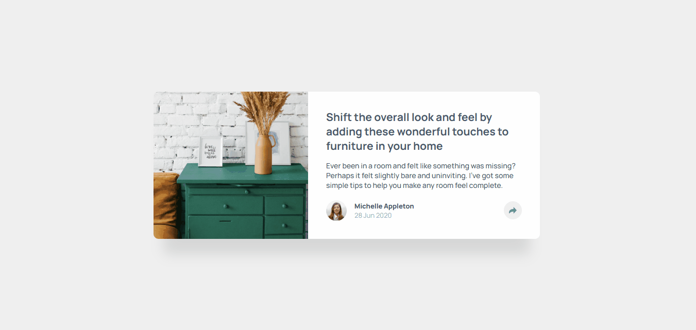
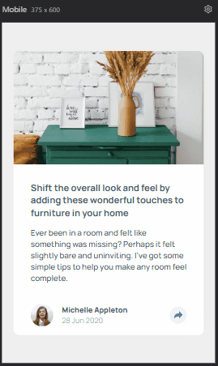

# Frontend Mentor - Article preview component

This is a solution the project Article preview component.
The project was developed through the challenge of the frontEnd mentor, that helped me improve coding skills by building realistic projects. 

## About the challenge

Users should be able to:

- View the optimal layout for the component depending on their device's screen size.
- See the sociel media share links when they click the share icon.

## Screenshot
  - DESKTOP AND ACTIVE ICON SHARE:
   

  - MOBILE AND ACTIVE ICON SHARE:   
   

### Built with
- Semantic HTML5 markup
- CSS custom properties
- Flexbox
- Mobile-first workflow
- JavaScript
  
### What I learned

In this project I had some difficulties that taught me many things. The first one was in the JavaScript part, I had difficulty executing a simple code, but trying to solve it.

The second was to maintain the design for both desktop and mobile, but I managed to solve it by researching and trying to find out why the error was occurring, and I managed to execute the project.

with that, besides breaking my head a lot, I was able to learn good and simple ways of executing a project that at first was complicated for me, but later I found it simple.